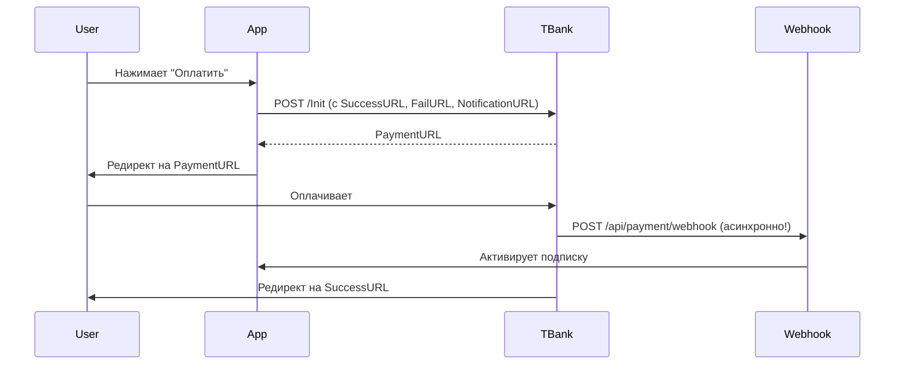

# Настройка платежей через Т-Банк

## Проблема: Платежи не активируют подписку

### Симптомы:
- После оплаты статус заказа остается `pending` в таблице `payment_orders`
- Подписка не активируется, баланс не пополняется
- В логах нет записей о получении webhook от Т-Банк

### Причина:
Т-Банк не отправляет webhook-уведомления на ваш сервер, либо URL-адреса редиректов не настроены.

## Решение

### 1. Добавьте переменную окружения

В файле `.env` (и `.env.local` для разработки) добавьте:

```env
# Для локальной разработки
NEXT_PUBLIC_SITE_URL=http://localhost:3000

# Для продакшена
NEXT_PUBLIC_SITE_URL=https://checklytool.com
```

### 2. Настройте NotificationURL в личном кабинете Т-Банк

Этот шаг **КРИТИЧЕСКИ ВАЖЕН**!

1. Зайдите в личный кабинет Т-Банк Acquiring
2. Перейдите в настройки вашего терминала
3. Найдите раздел "URL для уведомлений" или "NotificationURL"
4. Укажите URL:
   ```
   https://checklytool.com/api/payment/webhook
   ```

**ВАЖНО:**
- URL должен быть доступен из интернета
- Для локальной разработки используйте ngrok или localtunnel
- Т-Банк будет отправлять POST-запросы на этот URL после каждого изменения статуса платежа

### 3. Проверьте webhook endpoint

Убедитесь, что endpoint `/api/payment/webhook` доступен:

```bash
curl -X POST https://checklytool.com/api/payment/webhook \
  -H "Content-Type: application/json" \
  -d '{
    "TerminalKey": "test",
    "OrderId": "test",
    "Success": true,
    "Status": "CONFIRMED",
    "PaymentId": "123",
    "ErrorCode": "0",
    "Amount": 29900,
    "Token": "test"
  }'
```

Должен вернуться статус 403 (из-за неверной подписи), но не 404 или 500.

## Локальная разработка с ngrok

Для тестирования платежей локально:

### 1. Установите ngrok

```bash
# macOS
brew install ngrok

# или скачайте с https://ngrok.com
```

### 2. Запустите туннель

```bash
ngrok http 3000
```

Вы получите публичный URL типа `https://abc123.ngrok.io`

### 3. Обновите переменные окружения

```env
NEXT_PUBLIC_SITE_URL=https://abc123.ngrok.io
```

### 4. Настройте NotificationURL в Т-Банк

Укажите:
```
https://abc123.ngrok.io/api/payment/webhook
```

### 5. Перезапустите сервер

```bash
npm run dev
```

Теперь webhook от Т-Банк будут приходить на ваш локальный сервер!

## Как работает процесс оплаты



**ВАЖНО:** Webhook приходит **асинхронно** и может прийти раньше или позже, чем пользователь вернется на сайт!

## Отладка

### Проверка статуса платежа вручную

```sql
SELECT
  po.order_id,
  po.status,
  po.payment_id,
  po.created_at,
  up.check_balance,
  up.subscription_plan_id
FROM payment_orders po
LEFT JOIN user_profiles up ON po.user_id = up.user_id
WHERE po.user_id = 'user@example.com'
ORDER BY po.created_at DESC
LIMIT 5;
```

### Ручная активация подписки (для тестирования)

Если webhook не пришел, но оплата прошла:

```sql
-- 1. Проверяем статус в Т-Банк вручную
-- Используйте API GetState с PaymentId

-- 2. Если статус CONFIRMED, активируем вручную:
BEGIN;

-- Обновляем статус заказа
UPDATE payment_orders
SET status = 'paid'
WHERE order_id = 'ORDER_1760918982915_7gr098t';

-- Активируем подписку
UPDATE user_profiles
SET
  subscription_plan_id = '7aae118b-6cac-418e-91e9-b73290b99100',
  check_balance = 300,
  subscription_expires_at = NOW() + INTERVAL '30 days',
  subscription_started_at = NOW()
WHERE user_id = 'maxpro@gmail.com';

COMMIT;
```

### Логи webhook

Проверьте логи сервера на наличие записей:

```
[Payment Webhook] Received payload: ...
[Payment Webhook] Order updated successfully: ...
```

Если их нет - webhook не приходят. Проверьте настройки NotificationURL в Т-Банк.

## Проверка после настройки

1. **Создайте тестовый платеж**
2. **Оплатите тестовой картой** (для тестового режима)
3. **Проверьте логи** - должны появиться записи о webhook
4. **Проверьте БД** - статус должен стать `paid`, подписка активна

## Тестовые карты Т-Банк

Для тестового режима используйте:

| Карта | Результат |
|-------|-----------|
| 4300000000000777 | Успешная оплата |
| 5200000000000007 | Отклонена |

CVV: любой
Срок: любой в будущем
Имя: любое

## Частые ошибки

### 1. NotificationURL не настроен

**Ошибка:** Webhook не приходят вообще

**Решение:** Настройте NotificationURL в личном кабинете Т-Банк

### 2. Локальный сервер недоступен из интернета

**Ошибка:** Webhook приходят, но сервер не отвечает

**Решение:** Используйте ngrok для локальной разработки

### 3. Неверная подпись webhook

**Ошибка:** `[Payment Webhook] Invalid signature`

**Решение:** Проверьте, что `TBANK_TEST_PASSWORD` совпадает с паролем в личном кабинете

### 4. Поле duration_days не найдено

**Ошибка:** Ошибка при активации подписки

**Решение:** Обновлен код - теперь используется фиксированное значение 30 дней

## Переход на продакшен

1. Получите **боевые** реквизиты от Т-Банк
2. Обновите `.env`:
   ```env
   TBANK_TERMINAL_KEY=ваш_боевой_ключ
   TBANK_PASSWORD=ваш_боевой_пароль
   TBANK_MODE=production
   NEXT_PUBLIC_SITE_URL=https://checklytool.com
   ```
3. Настройте NotificationURL в **боевом** терминале:
   ```
   https://checklytool.com/api/payment/webhook
   ```
4. Проведите тестовую оплату реальной картой на минимальную сумму

## Мониторинг

Настройте мониторинг для:
- Failed webhooks (статус 403, 404, 500)
- Платежи в статусе `pending` более 1 часа
- Расхождение между статусом в Т-Банк и в БД

Используйте внешние сервисы типа Sentry для отслеживания ошибок в webhook endpoint.
