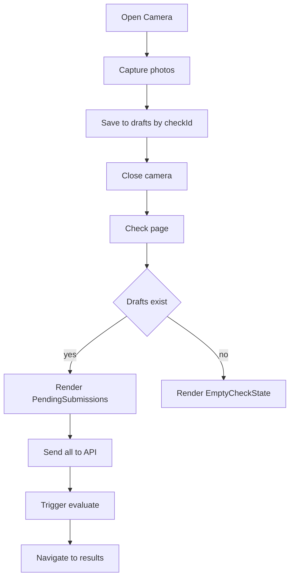

# Camera UI Refactor and Pending Submissions Plan

Goal: Align the camera capture and multi-student upload experience with the Figma designs and fix the post-close empty state by persisting pending works until they are sent to evaluation.

Figma references
- Camera overlay layout with controls and students strip: 2736-126
- Preview and student name edit controls: 2659-351
- Simplified camera unavailable state: 2737-150
- Pending list screen after closing camera: 2737-221
- After AI completes state: 2569-480

Current code landscape
- Entry points:
  - Empty state entry for a Check: [components/checks/EmptyCheckState.tsx](components/checks/EmptyCheckState.tsx)
  - Opens full screen camera: [components/camera/CameraWorkInterface.tsx](components/camera/CameraWorkInterface.tsx)
- Classic single-student flow:
  - Page and handlers: [app/dashboard/checks/[id]/submit/page.tsx](app/dashboard/checks/%5Bid%5D/submit/page.tsx)
    - Batch submit logic for several students: [function handleMultiStudentSubmit()](app/dashboard/checks/%5Bid%5D/submit/page.tsx:108)
- Multi-student UI prototype:
  - Orchestrator: [components/submission/SubmissionUploader.tsx](components/submission/SubmissionUploader.tsx)
  - Legacy scanner: [components/submission/CameraScanner.tsx](components/submission/CameraScanner.tsx)
  - Fullscreen modal: [components/submission/FullscreenCameraModal.tsx](components/submission/FullscreenCameraModal.tsx)
- Check details page:
  - Decides between empty state vs list: [app/dashboard/checks/[id]/page.tsx](app/dashboard/checks/%5Bid%5D/page.tsx)

Why the bug occurs after closing camera
- CameraWorkInterface closes and loses in-memory state.
- Check page immediately shows empty state again; there is no persisted “pending” model representing unsent student photos.
- After reload, still empty, because no local persistence.

Solution architecture overview
1) Introduce a Draft Submissions client store (localStorage + in-memory) keyed by checkId.
2) Refactor CameraWorkInterface to write to drafts as the single source of truth when the overlay is closed or while capturing.
3) Show PendingSubmissions on the check page if drafts exist for checkId.
4) Implement shared submit helper to convert drafts to multipart FormData and reuse existing API:
   - POST /api/checks/[checkId]/submissions
   - POST /api/submissions/[submissionId]/evaluate

Mermaid flow


Data contracts

Draft structures persisted in browser
```ts
interface DraftPhoto {
  id: string
  dataUrl: string
  createdAt: number
}

interface DraftStudent {
  id: string
  name: string
  photos: DraftPhoto[]
}

interface DraftBundle {
  checkId: string
  students: DraftStudent[]
  updatedAt: number
}
```

Storage API (client only)
- [lib/drafts.ts](lib/drafts.ts)
  - getDraft(checkId: string): DraftBundle | null
  - upsertDraft(bundle: DraftBundle): void
  - clearDraft(checkId: string): void
  - mutateDraft(checkId: string, fn: (bundle: DraftBundle) => DraftBundle): DraftBundle

Submission helper
- [lib/upload-submissions.ts](lib/upload-submissions.ts)
  - submitStudents(checkId: string, students: DraftStudent[], studentClass?: string): Promise<{ submissionId: string, student: DraftStudent }[]>
  - evaluateAll(submissions: { submissionId: string }[]): Promise<void>

Icon mapping
- Figma bottom controls:
  - Left: Upload from gallery → lucide Upload
  - Center: Shutter → lucide Camera
  - Right: Submit → Text button Отправить or lucide Send if required
- Top controls:
  - Right: Close → lucide X
  - Left: Switch camera → lucide RotateCcw or SwitchCamera
- Preview toolbar:
  - Retake → lucide Camera
  - Delete → lucide Trash2
  - Add page → lucide Plus
- Student strip arrow (under active student) → lucide ChevronRight

Planned implementation

1) Draft persistence
- Create [lib/drafts.ts](lib/drafts.ts) with a namespaced key like checklytool:drafts:{checkId}.
- Write from CameraWorkInterface whenever:
  - Photo captured
  - Student added/renamed
  - Photo deleted
  - On close: ensure the current in-memory is flushed to localStorage.

2) Camera overlay alignment to Figma
- Update [components/camera/CameraWorkInterface.tsx](components/camera/CameraWorkInterface.tsx):
  - Ensure bottom bar layout matches Figma 2736-126:
    - Left upload button (opens file input), center shutter, right submit.
    - Student names centered above bottom bar, active student with ChevronRight under the name.
    - Badge on each student with total photos count.
  - Add explicit simplified camera unavailable state per 2737-150:
    - Full-screen callout with retry button and simple copy (current error state exists, adjust layout and typography).
  - Preview/review mode based on 2659-351:
    - Bottom actions: Retake, Delete, Еще страница.
    - Student name pill at the top center with edit (pencil) toggling to input.
  - Persist on every mutation to drafts using lib/drafts.

3) Check page pending list
- Create [components/checks/PendingSubmissions.tsx](components/checks/PendingSubmissions.tsx):
  - Props: checkId: string
  - Reads draft via getDraft(checkId).
  - Renders a list of students with photo badges; allows removing a student or viewing last photo.
  - Primary CTA: Отправить все на проверку.
  - Secondary CTA: Продолжить съемку (opens CameraWorkInterface with existing drafts).
  - After successful send and evaluate, clearDraft(checkId) and navigate:
    - router.push(/dashboard/checks/[id]/results).
- Update [app/dashboard/checks/[id]/page.tsx](app/dashboard/checks/%5Bid%5D/page.tsx):
  - After fetch of server data, check for drafts via a client effect; if drafts exist, show PendingSubmissions instead of EmptyCheckState. Ensure SSR hydration-safe checks.

4) Upload and evaluation orchestration
- Implement [lib/upload-submissions.ts](lib/upload-submissions.ts) to move existing logic out of [function handleMultiStudentSubmit()](app/dashboard/checks/%5Bid%5D/submit/page.tsx:108) and reuse across PendingSubmissions and submit page.
- Convert dataUrl images to File with content type image/jpeg.
- Post to /api/checks/[id]/submissions for each student with images and optional class.
- After all are created, trigger POST /api/submissions/[id]/evaluate for each; await Promise.all.
- On success: navigate to results and clear drafts.

5) Accessibility and responsiveness
- Keep mobile-first sizes from Figma (370x viewport width tested).
- Keyboard shortcuts:
  - Space/Enter capture photo (already on CameraWorkInterface).
  - Escape closes overlay.
- Touch targets at least 44dp.

6) Visual polish
- Typography: Inter for body; Nunito for accent if used in Figma text, but keep project defaults unless already configured; Tailwind classes adjusted to match spacing.
- Color: Use Tailwind utilities; no additional assets required.
- Icons: lucide-react; ensure buttons have consistent chroma and hover states like Figma.

State and navigation
- EmptyCheckState opens camera; closing camera returns to check page.
- If drafts exist, PendingSubmissions is shown instead of EmptyCheckState.
- Upload pipeline:
  - Send all → evaluate all → redirect to results page with optional highlight of latest submissions.

Non-goals
- Changing backend contracts or database schema.
- Changing AI evaluation logic.
- Changing existing single-student tabbed uploader on submit page.

Edge cases
- No camera permission: show simplified screen (2737-150) with retry and file-choose fallback.
- Max photos per student reached: show small info text under the shutter.
- Offline or network errors during send: show toast errors per-student; keep drafts intact.

Detailed task breakdown

A. Storage and helpers
1. Create client drafts API
   - File: [lib/drafts.ts](lib/drafts.ts)
   - Functions: getDraft, upsertDraft, clearDraft, mutateDraft
2. Create upload helper
   - File: [lib/upload-submissions.ts](lib/upload-submissions.ts)
   - Functions: submitStudents, evaluateAll

B. Refactor camera overlay
1. Update [components/camera/CameraWorkInterface.tsx](components/camera/CameraWorkInterface.tsx)
   - Integrate drafts persistence on each mutation and on close
   - Align UI controls position, sizes, icons to Figma 2736-126
   - Add simplified unavailable state 2737-150

C. Pending UX on check page
1. Create [components/checks/PendingSubmissions.tsx](components/checks/PendingSubmissions.tsx)
   - List students with badges and actions
   - Buttons: Send all, Continue shooting
2. Update [app/dashboard/checks/[id]/page.tsx](app/dashboard/checks/%5Bid%5D/page.tsx)
   - Detect drafts on mount and conditionally render PendingSubmissions

D. Wire uploads and evaluation
1. Use [lib/upload-submissions.ts](lib/upload-submissions.ts) in PendingSubmissions
2. Keep existing submit page intact; optionally migrate later to shared helper

E. QA and test checklist
- Camera overlay matches Figma structure 2736-126
- Preview actions per 2659-351 work and persist in drafts
- Camera unavailable layout per 2737-150
- Closing camera shows PendingSubmissions instead of empty page
- Refresh page: drafts still there and render pending list
- Send all uploads successfully, then evaluation finishes and navigates to results
- After success, drafts cleared
- No TypeScript errors; mobile 370 width verified

Acceptance criteria
- On click Загрузить работы in empty state, camera opens with the exact control layout: left upload, center capture, right submit, and bottom students with badges and active arrow.
- Under the active student text, the ChevronRight is visible (per design).
- Photo counter badge values match number of photos per student.
- Clicking the right-arrow entry opens name edit and preview controls per 2659-351.
- Closing the camera returns to the check page where a pending list is shown, not an empty screen. Reloading the page preserves the pending list.
- Clicking Отправить все uploads data and triggers AI evaluation; after completion, user lands on the results screen. Partial failures show error toasts and leave drafts intact.
- Camera unavailable state renders per 2737-150 with retry and a way to choose files.

Time estimate
- A: 1.0 h
- B: 2.5 h
- C: 1.5 h
- D: 1.0 h
- E: 1.0 h
Total: ~7.0 h

Open questions for validation
- Student class source: We currently have studentClass field on submit page; for camera-driven flow, should we default to empty or offer a small selector before sending?
- Max photos per student: Keeping 5 as default matching CameraWorkInterface; confirm final limit.
- After evaluation, highlight the last batch on results? We can include highlight param same as single-student path.

Implementation order (todos map)
1) A.1 drafts.ts
2) A.2 upload-submissions.ts
3) B.1 camera overlay persistence and layout polish
4) C.1 PendingSubmissions.tsx
5) C.2 page conditional rendering
6) D.1 wire helpers
7) E QA and polish

Code locations to change
- Camera overlay: [components/camera/CameraWorkInterface.tsx](components/camera/CameraWorkInterface.tsx)
- Check page: [app/dashboard/checks/[id]/page.tsx](app/dashboard/checks/%5Bid%5D/page.tsx)
- New: [components/checks/PendingSubmissions.tsx](components/checks/PendingSubmissions.tsx), [lib/drafts.ts](lib/drafts.ts), [lib/upload-submissions.ts](lib/upload-submissions.ts)

Completion definition
- UI parity with Figma for camera and preview states.
- Draft persistence working and resilient to reloads.
- Pending list visible post-close and on reload.
- Submit pipeline succeeds, evaluates, and navigates to results.